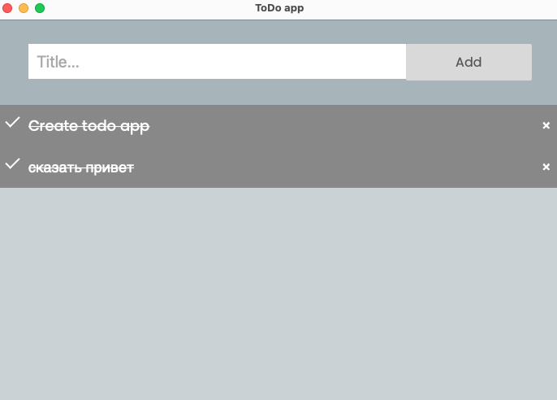

<h1>Todo app in Go</h1>

Todo app can store, delete, create your todo's with (not very) fine user interface.
Tested and created on macOS Big Sur. (It should work on the great Linux, and Windows)
UI library is https://github.com/webview/webview_go, frontend code was successfully copied and a little bit modified from https://www.w3schools.com/howto/howto_js_todolist.asp.
Clone this project and control your todo's wit this (not very) fine "ToDo app".
